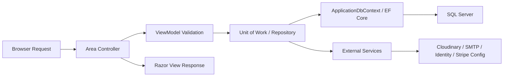

# Smart E-commerce System

An ASP.NET Core MVC e-commerce platform with a strong admin foundation, Identity-based authentication, and an expanding domain model for products, orders, payments, shipping, reviews, carts, and wishlists.

This project is still in progress. The current codebase covers roughly the first third of the planned product: the admin panel and account system are significantly ahead of the customer storefront and checkout experience.

## Project Goals

- Build a smart e-commerce platform with a maintainable MVC architecture.
- Provide admins with full catalog, order, payment, shipment, discount, review, and user management.
- Support customer authentication, addresses, cart/order domain logic, and eventually a complete storefront flow.
- Keep the codebase extensible for future features like checkout, wishlist UX, richer customer views, analytics, and recommendation/chat capabilities.

## Current Status

Implemented or partially implemented today:

- Admin dashboard and management flows for categories, products, variants, images, orders, shipments, payments, discounts, reviews, and users.
- ASP.NET Core Identity authentication with email confirmation, forgot/reset password, external login, profile, and address management.
- EF Core domain model for the full commerce system:
  `Category`, `Product`, `ProductVariant`, `ProductImage`, `ProductVariantImage`, `Cart`, `CartItem`, `Order`, `OrderItem`, `Payment`, `Shipment`, `Discount`, `Review`, `WishlistItem`, `Address`, `ApplicationUser`.
- Repository + Unit of Work pattern across the admin/business layer.
- Cloudinary-backed image upload service with local configuration support.
- SMTP email sender for confirmation and password reset emails.
- Automatic role/admin seeding and database migration on startup.

Not complete yet:

- Customer storefront is still minimal and not connected end-to-end to the full shopping flow.
- Cart, checkout, customer order history, wishlist UI, customer review flow, and online payment checkout are not finished as user-facing modules.
- Automated tests are not established yet.

## Tech Stack

- Backend: ASP.NET Core MVC on `.NET 10`
- Authentication: ASP.NET Core Identity
- ORM: Entity Framework Core 10 + SQL Server
- Architecture: Areas + Controllers + Repositories + Unit of Work + ViewModels
- Media: Cloudinary
- Email: MailKit SMTP
- Payments: Stripe package is configured in the project, but full online checkout is not complete yet
- Frontend: Razor Views, Bootstrap-style admin/customer UI, server-rendered MVC pages

## Solution Structure

```text
ECommerce_System/
├── ECommerce_System/
│   ├── Areas/
│   │   ├── Admin/
│   │   ├── Customer/
│   │   └── Identity/
│   ├── Data/
│   ├── Models/
│   ├── Repositories/
│   ├── Utilities/
│   ├── ViewModels/
│   ├── Views/
│   └── wwwroot/
├── ECommerce_System.slnx
└── README.md
```

### Areas

- `Admin`: operational back office for managing catalog, users, orders, shipments, discounts, payments, and reviews.
- `Identity`: authentication and account lifecycle.
- `Customer`: public/customer-facing area. Right now it is much lighter than the admin side.

### Core Folders

- `Data`: `ApplicationDbContext`, entity configurations, migrations.
- `Models`: domain entities and relationships.
- `Repositories`: generic repository, specialized repositories, unit of work.
- `Utilities`: shared constants, email sender, cloudinary service, DB initializer, settings models.
- `ViewModels`: request/view shaping for MVC views.
- `Views` and `wwwroot`: server-rendered UI and static assets.

## Architecture and Flow

The project follows a classic MVC flow with a repository abstraction on top of EF Core:



Typical request flow:

1. The request enters an Area controller such as `Admin/OrdersController` or `Identity/AccountController`.
2. The controller validates input using MVC model binding and ViewModels.
3. Business/data access goes through `IUnitOfWork` and repositories.
4. EF Core persists and loads entities from SQL Server.
5. External integrations are used when needed: Cloudinary for images, SMTP for mail, Identity for auth, Stripe configuration for future payment integration.
6. A view model is returned to a Razor view for rendering.

## Main Modules

### Admin

- `DashboardController`: operational summary for products, orders, revenue, customers.
- `CategoryController`: category CRUD.
- `ProductController`: product CRUD and status handling.
- `ProductVariantsController`: variant CRUD, stock/state behavior, variant image handling.
- `ProductImagesController`: product gallery and main image behavior.
- `OrdersController`: admin order creation, editing, status changes, coupon validation, payment sync.
- `ShipmentsController`: shipment creation/editing and order shipment state sync.
- `PaymentsController`: read-only payment tracking records.
- `DiscountsController`: coupon and discount management.
- `ReviewsController`: moderation workflow.
- `UsersController`: user listing, state management, and activity summary.

### Identity

- Registration and login
- Logout and access control
- Email confirmation and resend confirmation
- Forgot/reset password
- External login callback/confirmation
- Profile and address management

### Customer

- Home/landing entry point exists
- Full product browsing and purchase flow is still under construction

## Domain Model Snapshot

The current schema already models the intended full commerce flow:

- Catalog: `Category`, `Product`, `ProductVariant`, `ProductImage`, `ProductVariantImage`
- User/account: `ApplicationUser`, `Address`
- Shopping: `Cart`, `CartItem`, `WishlistItem`
- Order lifecycle: `Order`, `OrderItem`, `Payment`, `Shipment`
- Growth/quality: `Discount`, `Review`

This is a good sign architecturally: the data model is ahead of the UI, which makes the next implementation stages easier.

## Local Setup

### 1. Prerequisites

- .NET 10 SDK
- SQL Server LocalDB or SQL Server
- Visual Studio 2022 / Rider / VS Code

### 2. Configure settings

Update `ECommerce_System/appsettings.json` for local development as needed:

- `ConnectionStrings:DefaultConnection`
- `EmailSettings`
- `Authentication:Google`
- `Authentication:Facebook`
- `Stripe`
- `Cloudinary`

Recommended:

- Keep secrets in User Secrets or environment variables instead of committing real credentials.
- The project already has a `UserSecretsId` configured in the `.csproj`.

### 3. Restore and build

```powershell
dotnet restore
dotnet build ECommerce_System.slnx
```

### 4. Apply database migrations

The app applies pending migrations automatically on startup through `DBInitializer`, but you can also manage them manually with EF Core tools when needed.

### 5. Run the app

```powershell
dotnet run --project ECommerce_System/ECommerce_System.csproj
```

Default routes:

- Customer area: `/`
- Admin area: `/Admin`
- Identity login: `/Identity/Account/Login`

## Default Admin Account

The initializer seeds a default admin user for development:

- Email: `admin@ecommerce.com`
- Password: `Admin@123456`

This comes from `ECommerce_System/Utilities/SD.cs` and should be changed for any shared or production-like environment.

## Engineering Notes

- The current local build succeeds on the reviewed working tree.
- The codebase has a solid domain foundation, but some lifecycle and status-transition rules still need tightening.
- The repository paging abstraction currently handles paging well, but some screens still sort after pagination in controller code.
- The largest delivery gap is not the data model, but the unfinished customer-side experience and the lack of automated tests.

## Planned Direction

The next major implementation phases should focus on:

- Completing customer product browsing and product details
- Cart and wishlist UX
- Checkout and payment flow
- Customer order history and review submission
- Automated tests for critical admin and order workflows
- Hardening business rules around order/shipment/payment state transitions

## Repository Health Summary

What is already strong:

- Clear separation with Areas
- Consistent Unit of Work usage in admin flows
- Rich commerce domain model
- Identity and admin features are meaningfully progressed

What still needs work:

- Customer-facing completeness
- Automated testing
- Some business rule enforcement and workflow guards
- A bit more consistency between repository abstractions and controller behavior
